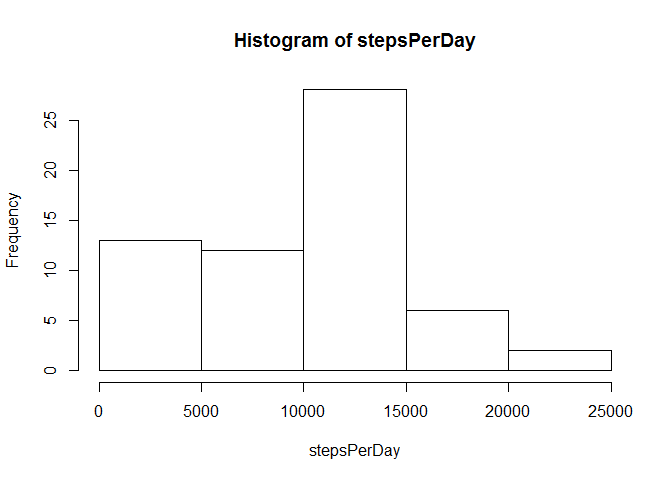

# Reproducible Research: Peer Assessment 1
Guergana Velitchkova Tzatchkova

## Loading and preprocessing the data


```r
data <- read.csv("activity.csv", header=TRUE)
summary(data)
```

```
##      steps                date          interval     
##  Min.   :  0.00   2012-10-01:  288   Min.   :   0.0  
##  1st Qu.:  0.00   2012-10-02:  288   1st Qu.: 588.8  
##  Median :  0.00   2012-10-03:  288   Median :1177.5  
##  Mean   : 37.38   2012-10-04:  288   Mean   :1177.5  
##  3rd Qu.: 12.00   2012-10-05:  288   3rd Qu.:1766.2  
##  Max.   :806.00   2012-10-06:  288   Max.   :2355.0  
##  NA's   :2304     (Other)   :15840
```


## What is mean total number of steps taken per day?

Histogram of total number of steps per day.

```r
stepsPerDay <- tapply(data$steps, data$date, sum, na.rm=TRUE)
hist(stepsPerDay)
```

 

Median of steps per day:


```r
median(stepsPerDay)
```

```
## [1] 10395
```

Mean of steps per day:


```r
mean(stepsPerDay)
```

```
## [1] 9354.23
```
## What is the average daily activity pattern?

5-minute interval (x-axis) and the average number of steps taken, averaged across all days (y-axis).


```r
stepsPerInterval <- tapply(data$steps, data$interval, sum, na.rm=TRUE)
meanPerInterval <- tapply(data$steps, data$interval, mean, na.rm=TRUE)

plot(unique(data$interval), meanPerInterval, type="l", xlab="Time Intervals", ylab="Average Steps per Interval")
```

 

Interval with maximum number of steps: (interval / total steps in that interval)


```r
stepsPerInterval[which.max(stepsPerInterval)]
```

```
##   835 
## 10927
```

## Imputing missing values

Total number of missing values in the dataset (i.e. the total number of rows with NAs)


```r
sum(complete.cases(data) == FALSE)
```

```
## [1] 2304
```

Devise a strategy for filling in all of the missing values in the dataset. The strategy does not need to be sophisticated. For example, you could use the mean/median for that day, or the mean for that 5-minute interval, etc.

Replacing NA values with mean for each 5-min interval


```r
myFunction <- function(x, index){
    if( is.na(x) ) { meanPerInterval[index][[1]] } else { x }
    
}
```

New dataset equal to the original dataset but with the missing data filled in.


```r
noNAdata <- data

noNAdata$steps <- mapply(myFunction, data$steps, seq_along(meanPerInterval)) 
```


Histogram of total number of steps per day with replaced NAs.

```r
stepsPerDaynoNA <- tapply(noNAdata$steps, noNAdata$date, sum, na.rm=TRUE)
hist(stepsPerDaynoNA, xlab="Total Steps per day")
```

 

Median of steps per day with estimate values:


```r
median(stepsPerDaynoNA)
```

```
## [1] 10766.19
```

Mean of steps per day with estimate values:


```r
mean(stepsPerDaynoNA)
```

```
## [1] 10766.19
```

**Do these values differ from the estimates from the first part of the assignment? What is the impact of imputing missing data on the estimates of the total daily number of steps? **

Yes, they do. The total steps is higher with the estimate values and the mean and the median are the same with estimate values. Also the frequency of steps between 5000 and 10,000 went down in relation to the values between 0 and 5000. 


## Are there differences in activity patterns between weekdays and weekends?


```r
noNAdata$weekday <- weekdays(as.Date(noNAdata$date, format="%Y-%m-%d"))
#create a vector of weekdays
weekdays1 <- c('lunes', 'martes', 'miércoles', 'jueves', 'viernes')
#Use `%in%` and `weekdays` to create a logical vector
#convert to `factor` and specify the `levels/labels`
noNAdata$weekday <-  factor((noNAdata$weekday %in% weekdays1)+1L,
      levels=1:2, labels=c('weekend', 'weekday'))

weekdays <- noNAdata[noNAdata$weekday == "weekday",]
weekends <- noNAdata[noNAdata$weekday == "weekend",]

#plot(weekends$interval, weekends$steps, type="l")
#plot(weekdays$interval, weekdays$steps, type="l")


library(lattice)
```

```
## Warning: package 'lattice' was built under R version 3.1.3
```

```r
#AvgStepsnoNAwDays <- tapply(weekdays$steps, weekdays$interval, mean)
#AvgStepsnoNAwEnds <- tapply(weekends$steps, weekends$interval, mean)

#AvgStepsnoNA <- tapply(noNAdata$steps, noNAdata$interval, noNAdata$weekday , mean)


aggData <- setNames(aggregate(formula = noNAdata$steps~noNAdata$interval+noNAdata$weekday, data = noNAdata,  FUN = mean ), c("Interval", "Weekday",  "AvgSteps"))


xyplot( aggData$AvgSteps ~ aggData$Interval | aggData$Weekday , type="l", layout=c(1,2) )
```

 
